# Tugas Pencarian Masalah di sekitar(vtuber case)

Nama: Yovi Prayudya Rizky Ramadhani / 5027251107 / Teknologi Informasi

## Deskripsi kasus

> Deskripsi kasus

Dalam dunia entertain sekarang, perkembangannya sangat pesan sekali. Sekarang mulai bermunculan konten-konten creator entah di youtube, tiktok, instagram, dll yang ingin berkarir. Dan pada tahun 2020, dunia entertain berubah. Muncul karakter 2d yang menjadi industri dunia entertain bernama *vtuber*. Perbedaan antara content kreator dan vtuber mungkin hanyalah sedikit seperti pembawaannya, karakternya yg vtuber menggunakan karakter anime, dll. Namun masih bingung gmn cara kerja vtuber ini sebenernya, program ini dikhususkan untuk membuat **Simulasi menjadi vtuber** dengan berbagai macam keunikan dan khas tersendiri. Dan program ini juga melakukan pendekatan menggunakan oop sederhana.

## Class diagram

> Class diagram

Berikut adalah class diagram dari codingan saya.
```
classDiagram

    class vtuber_activity {
        <<interface>>
        +lagu_vtuber(lagu: String) void
        +cover_lagu(lagu_cover: String) void
        +streaming() void
    }

    class vtuber {
        <<abstract>>
        #String nama
        #String hobi
        #String kegiatan_streaming
        #int umur
        +vtuber(nama, hobi, umur, kegiatan_streaming)
        +opening()* void
        +getumur() int
        +setUmur(setnewUmur: int) void
    }

    class agent_Vtuber {
        ~String agensi
        +agent_Vtuber(nama, hobi, umur, agensi, kegiatan_streaming)
        +opening() void
        +lagu_vtuber(lagunya: String) void
        +cover_lagu(covernya: String) void
        +streaming() void
    }

    class indie_Vtuber {
        +indie_Vtuber(nama, hobi, umur, kegiatan_streaming)
        +opening() void
        +lagu_vtuber(lagunya: String) void
        +cover_lagu(covernya: String) void
        +streaming() void
    }

    class circle_Vtuber {
        ~String circle
        +circle_Vtuber(nama, hobi, umur, circle, kegiatan_streaming)
        +opening() void
        +lagu_vtuber(lagu_buatan: String) void
        +cover_lagu(covernya: String) void
        +streaming() void
    }

    class Database_Vtuber {
        -String FOLDER_DB$
        -String NAMA_FILE$
        -foldernya_ada_atau_tidak()$ void
        +simpen_dulu_bossku(listVtuber: ArrayList~vtuber~)$ void
        +baca_filenya_bossku(listTujuan: ArrayList~vtuber~)$ void
    }

    class lylera {
        ~Scanner objeknya$
        ~ArrayList~vtuber~ list_vtuber$
        +pengenalan()$ void
        +list()$ void
        +deleteAllList()$ void
        +cekHasil()$ void
        +Collab_vtuber()$ void
        +donasi()$ void
        +graduateVtuber()$ void
        +sekarang_oop_combine()$ void
        +main(args: String[])$ void
    }

    vtuber <|-- agent_Vtuber : extends
    vtuber <|-- indie_Vtuber : extends
    vtuber <|-- circle_Vtuber : extends

    vtuber_activity <|.. agent_Vtuber : implements
    vtuber_activity <|.. indie_Vtuber : implements
    vtuber_activity <|.. circle_Vtuber : implements

    lylera ..> vtuber : uses
    lylera ..> Database_Vtuber : uses
    Database_Vtuber ..> vtuber : manages
```

Bisa dilihat lumayan panjang dalam implementasinya dikarenakan ada 3 file java yang masing-masing terhubung satu sama lain. Dan jika ingin melihat gambarnya, hasilnya sepert ini:

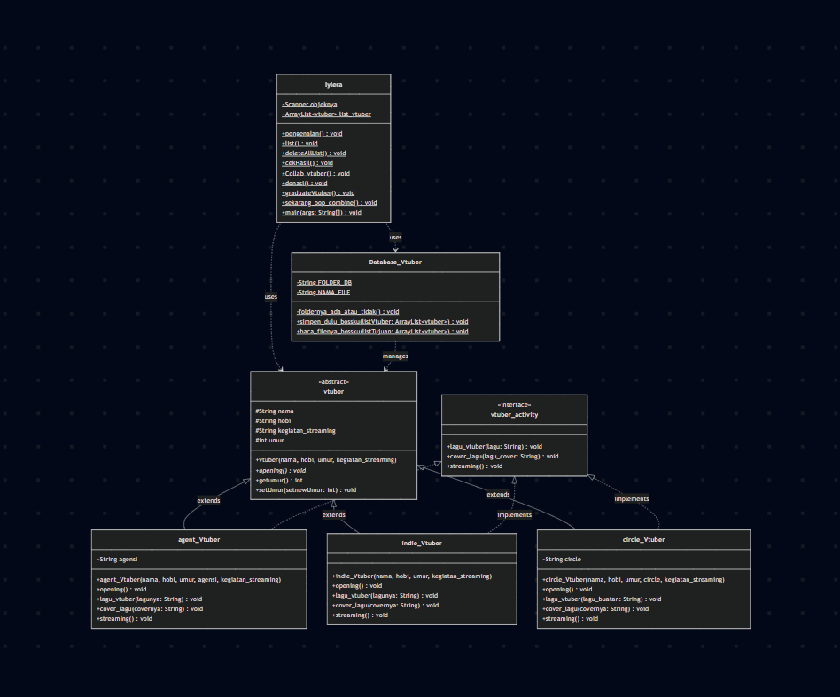

## file java

> Kode program Java

Ada 3 kode java. berikut kodenya:

- [lylera.java](src/lylera.java) ini adalah file java utamanya
- [vtuber.java](src/vtuber.java) ini adalah penggunaan oopnya
- [Database.java](src/Database_Vtuber.java) ini adalah database yang tersimpan

Tiap file memiliki cara kerja yang berbeda-beda. `lylera.java` untuk program utama dari codingan ini, `vtuber.java` untuk program penggunaan oopnya, dan `Database.java` untuk menyimpan data-data yang sudah dibikin oleh pengguna.

## Output

> Screenshot output

Berikut beberapa output dari program `lylera.java` :

1. Menu program mainnya

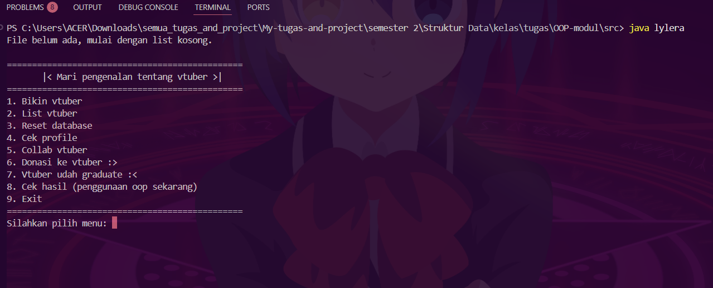

2. Membuat user dahulu

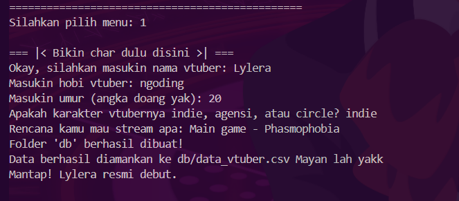

3. List vtuber

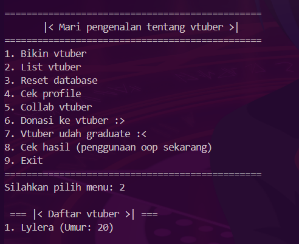

4. Check profile

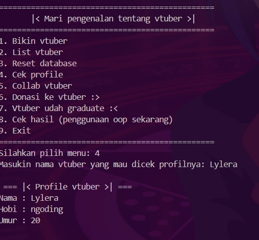

5. Sistem collab

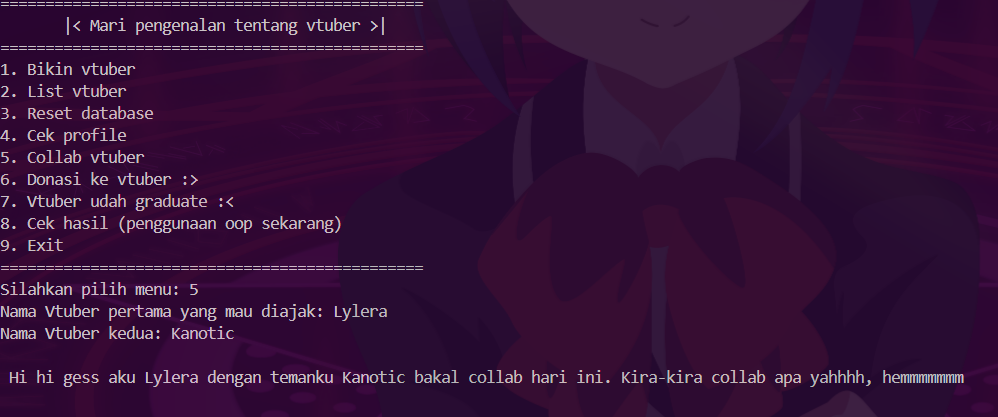

6. Sistem donasi

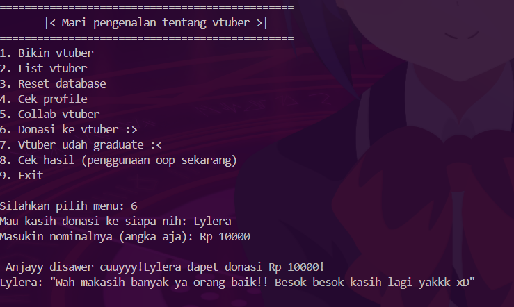

7. Sistem graduate (bisa dibilang sistem delete sih)

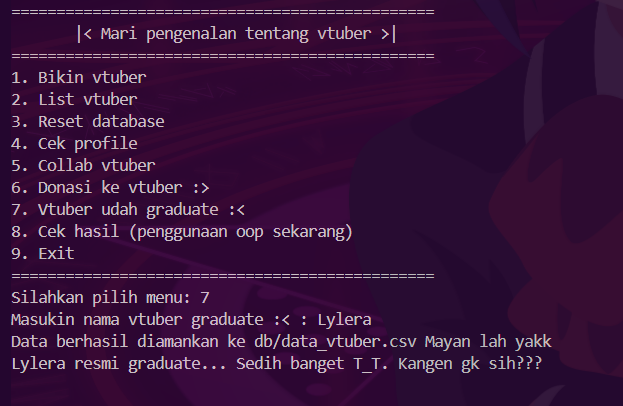

8. Sistem oop

    8.1 Menu 1

    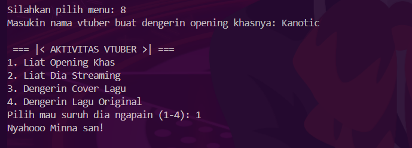

    8.2 Menu 2

    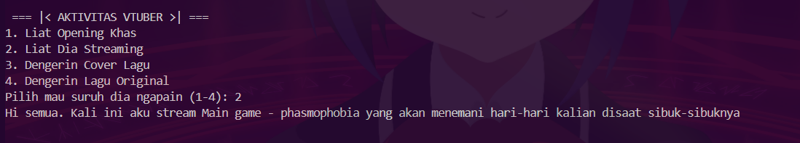

    8.3 Menu 3

    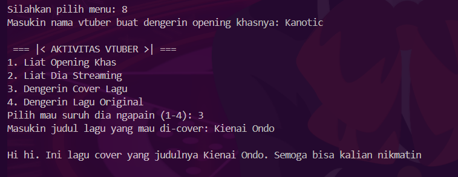

    8.4 Menu 4

    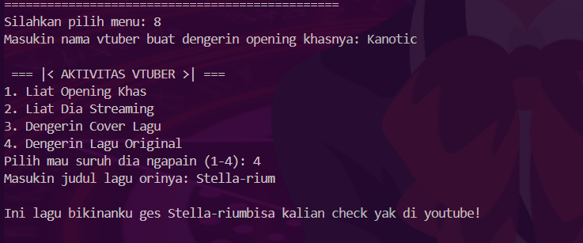

## OOP

> Penjelasan prinsip-prinsip OOP apa saja yang diterapkan

Dari sekian banyak output, penggunaan oop terdapat di file `vtuber.java`. Oleh karena itu, berikut source code

```java

/*
    Ini adalah file khusus untuk menyimpan oop
*/

abstract class vtuber {

    //setup awalnya
    protected String nama, hobi, kegiatan_streaming;
    protected int umur;
    
    public vtuber(String nama, String hobi, int umur, String kegiatan_streaming) {
        this.nama = nama;
        this.hobi = hobi;
        this.umur = umur;
        this.kegiatan_streaming = kegiatan_streaming;
    } 

    abstract void opening();
    
    public int getumur() {
        return this.umur;
    } 
    public void setUmur(int setnewUmur) {
        this.umur = setnewUmur;
    }
}

interface vtuber_activity {
    void lagu_vtuber(String lagu);
    void cover_lagu(String lagu_cover);
    void streaming();
}

class agent_Vtuber extends vtuber implements vtuber_activity {

    // Nggak pake private biar bisa diakses Database
    String agensi;

    public agent_Vtuber(String nama, String hobi, int umur, String agensi, String kegiatan_streaming) {
        super(nama, hobi, umur, kegiatan_streaming);
        this.agensi = agensi;
    }

    @Override
    void opening() {
        System.out.println("Konnichiwa minnasan, watashiwa " + this.nama + ". I'm from " + this.agensi);
    }

    @Override
    public void lagu_vtuber(String lagunya) {
        System.out.println("Hi gesss. Aku lagi cover lagu " + lagunya + " dan kalian bisa dengerin di youtube yoww");
    }

    @Override
    public void streaming() {
        System.out.println("Hallo halo semuanya. hari ini kita streaming " + kegiatan_streaming + " yak.");
    }
    @Override
    public void cover_lagu(String covernya) {
        System.out.println("Halo semuaaa. lagu " + covernya + " coveran lagi release nihh. bisa di check yakk");
    }
}

class indie_Vtuber extends vtuber implements vtuber_activity {

    public indie_Vtuber(String nama, String hobi, int umur, String kegiatan_streaming) {
        super(nama, hobi, umur, kegiatan_streaming);
    }

    @Override
    void opening() {
        System.out.println("Nyahooo Minna san!");
    }
    @Override
    public void streaming() {
        System.out.println("Hi semua. Kali ini aku stream " + kegiatan_streaming + " yang akan menemani hari-hari kalian disaat sibuk-sibuknya");
    }
    @Override
    public void lagu_vtuber(String lagunya) {
        System.out.println("Ini lagu bikinanku ges " + lagunya + "bisa kalian check yak di youtube!");
    }
    @Override
    public void cover_lagu(String covernya) {
        System.out.println("Hi hi. Ini lagu cover yang judulnya " + covernya + ". Semoga bisa kalian nikmatin");
    }
}

class circle_Vtuber extends vtuber  implements vtuber_activity{ 
    
    String circle;

    public circle_Vtuber(String nama, String hobi, int umur, String circle, String kegiatan_streaming) {
        super(nama, hobi, umur, kegiatan_streaming);
        this.circle = circle;
    }

    @Override
    void opening() {
        System.out.println("Hi hi semua. Kembali lagi dengan aku " + this.nama + " dan kalian bisa join discord aku dan temen-temenku yak di " + this.circle + " discord");
    }
    @Override
    public void streaming() {
        System.out.println("Halooo ges. Aku dan " + circle + " Akan stream " + kegiatan_streaming + " bisa di check di pov mereka ya gess.");
    }
    @Override
    public void cover_lagu(String covernya) {
        System.out.println("hi gesss. Lagu " + covernya + " coveran baru nichh. Dengerin gk sihhh??");
    }
    @Override
    public void lagu_vtuber(String lagu_buatan) {
        System.out.println("Yow. Baru release nih " + lagu_buatan + " siapa tau kan bisa menemani hari kalian");
    }
}
```

source code: [vtuber.java](src/vtuber.java)

Disini saya menggunakan beberapa oop:

- Abstraction pada `class vtuber` dan pada `void opening()`. Ini adalah set awal mulanya yaitu `class vtuber` sebagai induk dari keseluruhan function dan `abstract void opening();` untuk memanggil opening dari setiap para vtuber di dalam class inheritancenya. 

- Encapsulation pada penentuan nama, hobi, kegiatan stream, dan umur di `class vtuber`

Diterapkan pada pembungkusan atribut dasar (nama, hobi, umur, kegiatan stream) di dalam class vtuber. Atribut tersebut menggunakan access modifier protected dan private agar datanya aman dan hanya bisa diakses atau diubah melalui jalur yang diizinkan, seperti penggunaan methode getter dan setter yaitu di code:

```java
// section getternya
public int getumur() {
        return this.umur;
    } 
    // section setternya
    public void setUmur(int setnewUmur) {
        this.umur = setnewUmur;
    }
```

- inheritance dan interface menjadi 1 pada section `indie_vtuber`, `agent_vtuber`, dan `circle_vtuber`. 

Disini untuk inheritancenya sendiri itu `indie_vtuber, agent_vtuber` dan `circle_vtuber` di extend dari class vtuber. Mereka mewarisi beberapa stat atau atribut dari class `vtuber` itu sendiri dengan penambahan `agent_vtuber` yaitu agensi dan `circle_vtuber` itu circlenya. Untuk `indie_vtuber` tidak ada penambahan apapun dan atributnya masih sama dengan classnya. Untuk interface ini yaitu penggunaan `vtuber activity` section:

```
interface vtuber_activity {
    void lagu_vtuber(String lagu);
    void cover_lagu(String lagu_cover);
    void streaming();
}
```

Dan penggunaan interfacenya ini diimplementasikan menjadi 1 dengan inheritance dikarenakan penggunaan dari oop ini sendiri menyatu dengan yang utama. Disini ditambahkan beberapa aktivitas dari vtuber itu sendiri berupa lagu buatannya, lagu coveran, dan kegiatan streamnya itu sendiri. Dan untuk implementasinya itu berada di section 

```java
@Override
    public void streaming() {
        System.out.println("Halooo ges. Aku dan " + circle + " Akan stream " + kegiatan_streaming + " bisa di check di pov mereka ya gess.");
    }
    @Override
    public void cover_lagu(String covernya) {
        System.out.println("hi gesss. Lagu " + covernya + " coveran baru nichh. Dengerin gk sihhh??");
    }
    @Override
    public void lagu_vtuber(String lagu_buatan) {
        System.out.println("Yow. Baru release nih " + lagu_buatan + " siapa tau kan bisa menemani hari kalian");
    }
```

Dari setiap inheritancenya yang berbeda-beda responsenya 

- Polymorphism pada setiap section di point ke empat penggunaan `override`

Dikarenakan banyak bentuk dari inheritancenya ini, polymorphism memudahkan untuk memanggil function yang ada di setiap inherintance berdasarkan inputan dari usernya itu sendiri. Seperti contoh vtuber indie yang akan memanggil inheritance `indie_Vtuber` dan dia akan memeriksa pada database `Data_vtuber.csv` ini apakah dia `indie` atau `agent` atau `circle`? jika memenuhi salah satunya, polymorphism akan memanggil inheritance dari setiap function status vtubernya dengan respond yang tentunya berbeda-beda 

## Keunikan

> Penjelasan keunikan yang membedakan dengan individu lain

Saya kurang tau perbedaan program saya dengan individu yang lain seperti apa. Namun dalam program saya ini terdapat 3 file yang bisa terhubung satu sama lain dengan penggunaan oop yang terhubung ke dalam database csvnya ini. Lalu juga pemanggilan oop ada di file `lylera.java` yang menjadi program utama untuk menghubungkan 2 file ini dan memanggil mereka ke dalam main. Jika ditanya tentang keunikan, kemungkina:

- 3 file yang terhubung satu sama lain
    - [lylera.java](src/lylera.java) program yang dirancang sebagai menu utama
    - [vtuber.java](src/vtuber.java) program yang dirancang mengurus penggunaan oopnya
    - [Database.java](src/Database_Vtuber.java) program yang dirancang mengurus penggunaan database seperti membaca, membuat, dan menghapusnya.
- Simulasi vtuber dan list vtubernya

